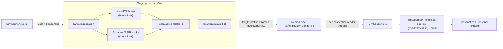

# Architecture

BirriMonitor is a small two-process system plus two shared libraries. A **launcher** injects a **hook DLL** into the target process; the DLL captures plaintext at the API boundary and streams it over a **named pipe** to a **logger**, which reassembles, decodes, and renders the traffic.

## Modules

| Module | Type | Role |
|---|---|---|
| `BirriMonitor.dll` | Injectable DLL | Lives inside the target process. Installs hooks, extracts buffers, and hands raw data to the IPC client. **No** HTTP parsing, decompression, or formatting here — the hook path stays as short and light as possible. |
| `BirriLauncher.exe` | Console EXE | Starts the target suspended (or attaches to a running one), injects the DLL, runs the hooks-ready handshake, and diagnoses permission failures. |
| `BirriLogger.exe` | Console EXE | Named-pipe server. Receives raw frames, correlates and reassembles transactions and TLS streams, decompresses bodies, and renders them to the console. |
| `HookEngine` | Static library | Hook orchestration: MinHook setup, per-function hook installation, context maps (`hConnect → host/port`, `hRequest → state`, SSPI context → stream), guard flags, message dispatch. |
| `IpcClient` | Static library | Named-pipe client compiled into the DLL. Owns a background I/O thread; hooks only enqueue messages and never block. |
| `IpcCommon` | Shared header | Wire protocol structs, constants, payload serializer/deserializer, timestamp helpers. |

The directory layout mirrors this: `src/BirriMonitor/`, `src/BirriLauncher/`, `src/BirriLogger/`, `src/HookEngine/`, `src/IpcClient/`, `src/IpcCommon/`, plus `src/SspiTarget/` (a test client, see [[Getting Started|Getting-Started]]).

## Data flow

The pipe name is `\\.\pipe\BirriMonitorIpc`; the handshake event is `Local\BirriMonitorHooksReady`.

## Separation of concerns

The design rule is that the injected code stays **thin and fast**, and the logger does the **heavy lifting**:

- **Inside the target** (`BirriMonitor.dll` + `HookEngine`): capture buffers, assign IDs, enqueue framed messages. No parsing of HTTP, no decompression, no formatting. A hook that returns quickly is a hook that cannot stall the application being monitored.
- **In the logger** (`BirriLogger.exe`): frame accumulation, request/response correlation, `Transfer-Encoding: chunked` reassembly, gzip/deflate/brotli decoding (via vendored zlib/brotli), body truncation, and console rendering.

This is why the DLL links only MinHook plus the Windows HTTP/security libs, while zlib and brotli are linked only into the logger.

## Injection & handshake

1. The launcher creates the named event `Local\BirriMonitorHooksReady` **before** injecting.
2. `DllMain(PROCESS_ATTACH)` does nothing heavy under the loader lock: it calls `DisableThreadLibraryCalls`, spawns one background init thread, and returns immediately. All init state is `std::atomic`.
3. The init thread starts `IpcClient` (which connects to the pipe with retry/backoff), then initializes MinHook and installs hooks via `HookEngine::Initialize()`, then — once the pipe is connected — sends a `HookStatus` message and signals the ready event.
4. **Method A** (suspended start) waits on the event with a 10-second timeout **before** resuming the target's main thread, using `WaitForMultipleObjects` so a target that exits early is distinguished from a plain timeout. **Method B** (attach by PID) waits the same way with a shorter 5-second timeout before reporting success.

Because the handshake is event-driven, there are no fixed `Sleep()`s in the launcher and no startup traffic is lost when the DLL initializes faster than expected.

## The two capture layers

Both capture layers run simultaneously inside the same DLL and share the same IPC transport. They are independent: an app that uses only WinHTTP produces only `TRANSACTION` blocks; an app that uses SSPI directly produces `SCHANNEL` blocks; an app that does both produces both.

### Layer 1 — WinHTTP (`winhttp.dll`)

Nine hooks, chosen so a full URL and both bodies can be reconstructed:

| Hook | What it captures |
|---|---|
| `WinHttpConnect` | Host and port; stored in a `hConnect → (host, port)` map |
| `WinHttpOpenRequest` | Verb, path+query, protocol version, `WINHTTP_FLAG_SECURE` flag (→ scheme), and a **fresh unique request ID** (never the raw `HINTERNET` value, which WinHTTP may reuse after a close) |
| `WinHttpAddRequestHeaders` | Headers added after the request is opened |
| `WinHttpSendRequest` | Initial headers plus any body passed inline (`lpOptional`) |
| `WinHttpWriteData` | The rest of the request body when it is written in multiple calls |
| `WinHttpReceiveResponse` | After success, the DLL itself calls `WinHttpQueryHeaders(WINHTTP_QUERY_RAW_HEADERS_CRLF)` to grab the whole raw status line + headers in one shot |
| `WinHttpQueryDataAvailable` | Detects end-of-response when 0 bytes are reported |
| `WinHttpReadData` | Response body chunks; handles the internal `FALSE` + `ERROR_MORE_DATA` case as a successful read |
| `WinHttpCloseHandle` | Emits the final `TransactionEnd` (with truncation flags and byte totals) and cleans up the context maps |

The full URL is always rebuilt as `scheme://host:port/path?query` — the port is shown explicitly even for 80/443. Bodies are capped at 64 MiB per direction in the DLL (captured "at the source"); anything beyond that is reported as truncated with the true total byte count.

### Layer 2 — Schannel/SSPI (`secur32.dll`)

Four hooks for applications that do TLS directly through SSPI (custom HTTPS libraries, RDP-style clients, WebSockets with self-managed TLS), including TLS 1.3:

| Hook | What it captures |
|---|---|
| `InitializeSecurityContextW` | Registers a new stream, assigns `stream_id = (thread_id << 32) | seq`, and records the target hint (the `pszTargetName`, i.e. the SNI hostname) |
| `EncryptMessage` | Plaintext **before** encryption (captured from `SECBUFFER_DATA` before the trampoline runs, since Schannel encrypts in place) |
| `DecryptMessage` | Plaintext **after** decryption (only `SECBUFFER_DATA`); also finalizes the stream on `SEC_E_CONTEXT_EXPIRED` |
| `DeleteSecurityContext` | Signals stream close and sends `SchannelStreamEnd` |

Hooks are installed only when needed: before installing, the engine checks whether `schannel.dll` (fallback `ncrypt.dll`) is loaded. Because Method A injects before the target has loaded anything, a lightweight **late-bind thread polls every 100 ms** and installs the Schannel hooks the moment Schannel appears, then exits. A target that never uses TLS never gets Schannel hooks at all.

### How double-capture is avoided

WinHTTP uses Schannel internally for HTTPS. Without a guard, every HTTPS WinHTTP request would appear twice — once as a `TRANSACTION` and once as a raw `SCHANNEL` stream. The fix is a **shared re-entrancy guard** (`hook_common.h`): `thread_local` flags set while any WinHTTP or Schannel hook is executing. The Schannel hooks pass through when called from inside a WinHTTP hook, so the internal Schannel contexts WinHTTP creates are never registered as streams — `EncryptMessage`/`DecryptMessage` find no stream for them and ignore them. Result: HTTPS over WinHTTP is reported once, as a `TRANSACTION`; only Schannel usage that did *not* originate inside a WinHTTP hook becomes a `SCHANNEL` stream.

## IPC design

- **Wire format:** every message is a 44-byte header (magic `0x42495252`, version 1, type, flags, request ID, PID, timestamp, payload length) followed by a payload. Serialization is explicit `memcpy` into byte buffers — no struct-hack casts.
- **Non-blocking hooks:** hooks only push a message onto a bounded queue (2048 messages). A background I/O thread in `IpcClient` drains the queue and writes to the pipe with overlapped I/O. If the queue is full, the newest message is dropped and a counter is incremented (surfaced as a `DropCount` message after reconnect). If the pipe is broken, messages are dropped in the send path — reconnection is a separate concern with exponential backoff (250 ms → 5 s max).
- **Correct framing on the wire:** named pipes do not guarantee message-aligned reads, so the logger accumulates bytes and only parses once a full length-prefixed frame is available; the header is validated (magic, version, payload ≤ 16 MiB) before use.
- **Correlation:** the DLL assigns monotonically increasing request IDs (atomic counter) instead of using `HINTERNET` values. The logger keys every transaction and stream by `(PID, requestId)`, which keeps concurrent and interleaved requests distinct and is ready for multiple targets in one logger session.

## Logger pipeline

- Named-pipe server with `PIPE_UNLIMITED_INSTANCES`; each connection gets a reader thread doing overlapped `ReadFile` with clean shutdown via a stop event (no busy-loop polling). A single-instance mutex (`Local\BirriMonitorLoggerMutex`) prevents two loggers from fighting over the pipe.
- Received frames are dispatched by type: transaction start/body/response-headers/response-end/transaction-end, plus the four Schannel stream messages.
- A **sweeper thread** (1 s interval) finalizes transactions and streams that never completed within the timeout window (default 300 s, adjustable with `--timeout`) and renders them as timed out instead of leaving them pending forever. On shutdown, `FlushPending()` renders everything still in flight.
- Rendering: transactions appear when their response completes (all bytes read or the request handle closed) — see [[Usage]] for the exact block layout. Control characters are escaped before printing to keep untrusted network data from corrupting the console.
